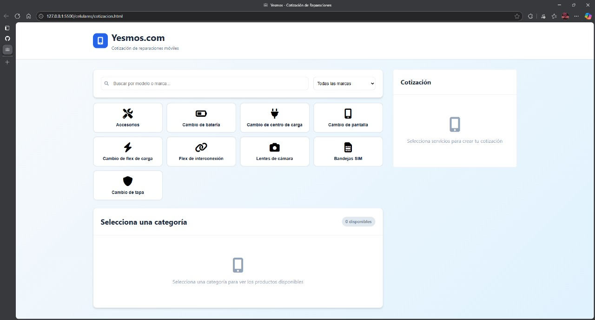

# 🛠️ Cotizador de Reparaciones

Aplicación web para generar, gestionar y enviar cotizaciones de reparaciones de forma rápida y profesional.  
Ideal para talleres, técnicos independientes o empresas que desean agilizar el proceso de presupuestar trabajos.

## 🚀 Características

- 📋 **Creación rápida de cotizaciones** con detalles de piezas, mano de obra y precios.
- 📧 **Envío por correo** de la cotización en PDF al cliente.
- 💾 **Historial de cotizaciones** para consultar y duplicar.
- 🔍 **Búsqueda y filtrado** por cliente, fecha o estado.
- 📱 **Diseño responsive** compatible con dispositivos móviles.
- 🔒 **Gestión de usuarios** con roles (administrador/técnico).

## 🖼️ Vista previa



## 🛠️ Tecnologías utilizadas

- **Frontend:** HTML5, CSS3, JavaScript / React (opcional según tu stack)
- **Backend:** Node.js + Express / Laravel / Django (dependiendo de implementación)
- **Base de datos:** MySQL / PostgreSQL / MongoDB
- **Generación de PDF:** jsPDF / PDFKit
- **Autenticación:** JWT / Passport / Auth0

## 📦 Instalación y ejecución

```bash
# Clonar repositorio
git clone https://github.com/Shooukoo/Pagina-yesmos.git

# Entrar a la carpeta del proyecto
cd cotizador-reparaciones

# Instalar dependencias
npm install   # o yarn install

# Configurar variables de entorno
cp .env.example .env
# Edita el archivo .env con tu configuración (DB, email, etc.)

# Ejecutar en desarrollo
npm run dev

# Compilar para producción
npm run build
